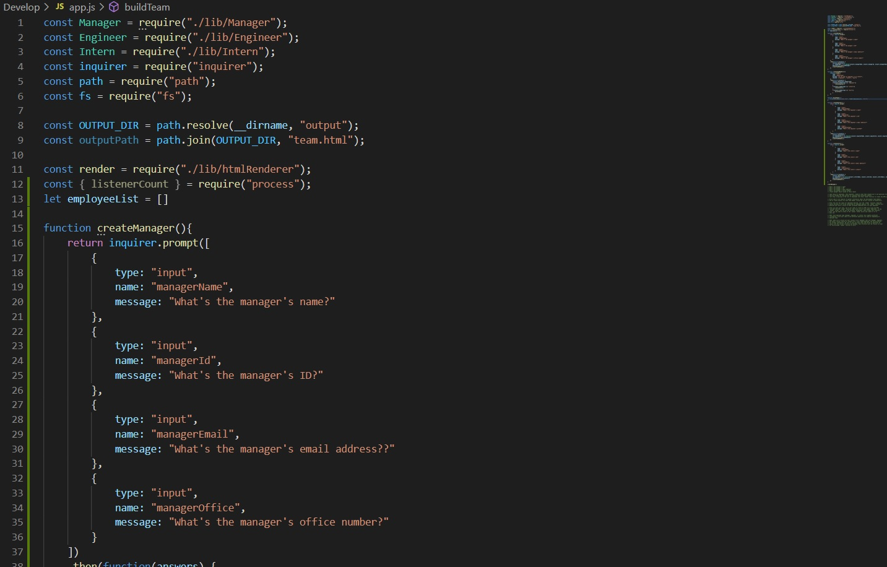
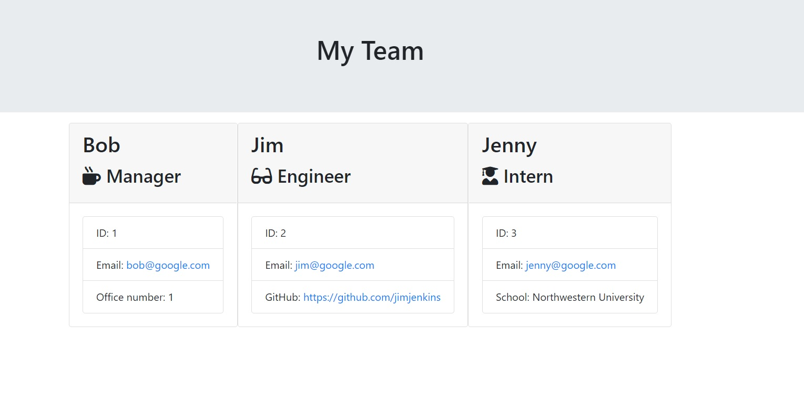

* Employee Template Engine

<!-- Live link to deployed app -->
Repository: https://github.com/Mdudzik92/homework10
Deployed app: https://mdudzik92.github.io/homework10/

<!-- Technologies used -->
Node.js, Javascript, JSON

<!-- Explanation of what the app is -->
This is an app which builds a software engineering team generator command line application. The working tests provide the user with a series of prompts to fill out the information regarding the members of their team, and prints them on a seperate html page that compiles their team. 

<!-- Screenshot -->

<!-- License -->
MIT

<!-- Contact information -->
Email: mdudzik92@gmail.com 